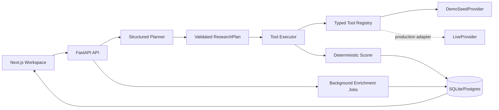

# Outmate GTM Intelligence Research & Enrichment Workspace

A production-oriented technical assessment implementation for deterministic, evidence-backed B2B intelligence. The LLM/planner layer is bounded by Pydantic contracts; tools are typed and provider-swappable; scoring is pure application code; every material claim is tied to provenance.

## Architecture



## Repository

- `backend/app/api/routes`: research, entities, enrichments, health, export
- `backend/app/engine`: planner, executor, scorer
- `backend/app/tools`: typed provider registry and demo/live seams
- `backend/app/models`: relational entities + Pydantic contracts
- `backend/app/seed`: exactly 12 SaaS accounts, 24 decision makers, 50+ evidence records
- `backend/app/eval`: 10-scenario evaluation harness
- `frontend/src/components`: composer, dense intelligence table, evidence drawer

## Provenance and scoring

The score is never generated by the model:

`ICP Fit = (0.30 × EmployeeBandFit) + (0.25 × GeoFit) + (0.25 × IndustryFit) + (0.20 × IntentSignalFit)`

The stored `Score.breakdown` includes each factor, its weight, the exact formula, and the Evidence IDs used for the entity. Conflicts remain as separate evidence records. Conflict and stale flags reduce the intent component rather than silently deleting inconvenient observations.

Evidence types:
- `observed`: directly represented by a fetched source
- `derived`: inferred/constructed from available information
- `stale`: source is older than the freshness policy
- `conflicting`: another source materially disagrees

## Quickstart

### Local backend

```bash
cd backend
python -m venv .venv
source .venv/bin/activate
pip install -r requirements.txt
python -m app.seed.seeder
uvicorn app.main:app --reload --port 8000
```

### Local frontend

```bash
cd frontend
npm install
NEXT_PUBLIC_API_URL=http://localhost:8000 npm run dev
```

Open `http://localhost:3000`.

### Docker

```bash
docker-compose up
```

The backend is available at `http://localhost:8000/docs`.

## Deployment

Frontend: Vercel. Set `NEXT_PUBLIC_API_URL` to the deployed FastAPI origin.

Backend: Render, Railway, or Fly.io. For production, set `DATABASE_URL` to PostgreSQL and replace `DemoSeedProvider` with a `LiveProvider` backed by permitted search/company-data providers. For multi-worker production deployments, move background work to a durable queue/worker system while retaining the same job contracts.

## Seed command

```bash
python -m app.seed.seeder
```

This creates exactly 12 cohesive B2B SaaS companies, 24 decision makers and 50+ evidence records, including:
- contradictory Northstar headcount
- contradictory MapleOps location
- stale BlueLedger and OrbitHR signals
- insufficient/derived evidence for LumenFlow and QuantumDesk

The URLs use reserved `.example` domains so the demo cannot accidentally present invented live websites as real sources. The enrichment adapter uses an explicitly labeled local demo provenance URL.

## Evaluation harness

```bash
cd backend
python -m app.eval.test_harness
```

It prints P/F status plus Structured Output Validity % and Grounding Accuracy % for the 10 required scenarios.

## AI usage disclosure

The assessment separates AI planning from execution. The included adapter is deterministic and does not require paid API keys. A production model adapter can implement the same `Planner.plan()` contract using OpenAI, Anthropic, Gemini, or LiteLLM structured output. The model may propose bounded steps and hypotheses; it is not trusted with database access, arbitrary code execution, tool implementation, or score calculation.

## 2-minute Loom walkthrough

0:00–0:15 — Open the workspace. Explain the composer, cost estimate, bounded plan, and seeded evidence.

0:15–0:35 — Run the standard North America 100–1000 employee B2B SaaS query. Open Inspect Plan and show `account_search -> person_discovery -> evidence_fetch`.

0:35–0:55 — Open an account row. Show deterministic ICP math, weights, Evidence IDs, source URL, timestamp, evidence type, and confidence. Open the contradictory Northstar record and point out the conflict note.

0:55–1:10 — Use the ICP >75 filter, search, row selection, and CSV export.

1:10–1:30 — Select accounts, choose an enrichment operation, submit it, and show the queued/background lifecycle. The row-level retry endpoint reruns only non-completed rows.

1:30–1:45 — Explain stale evidence and incomplete evidence states. Explicitly show “No verified signals detected” when a verified signal is absent.

1:45–2:00 — Run `python -m app.eval.test_harness`. Walk through all 10 scenarios: happy path, vague input, zero result, conflict, stale evidence, budget protection, deterministic score, enrichment idempotency, malformed planner recovery, and CSV integrity.
